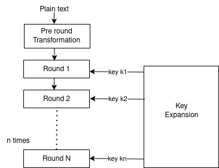
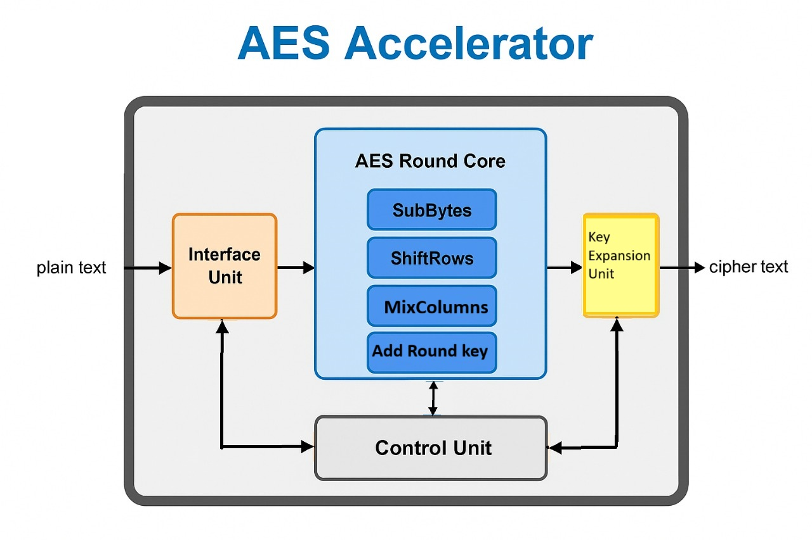
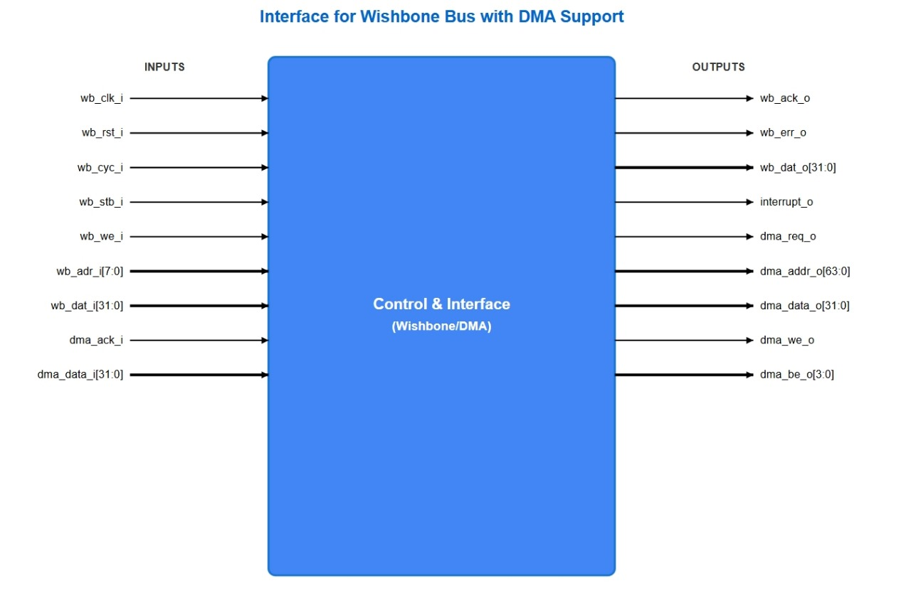
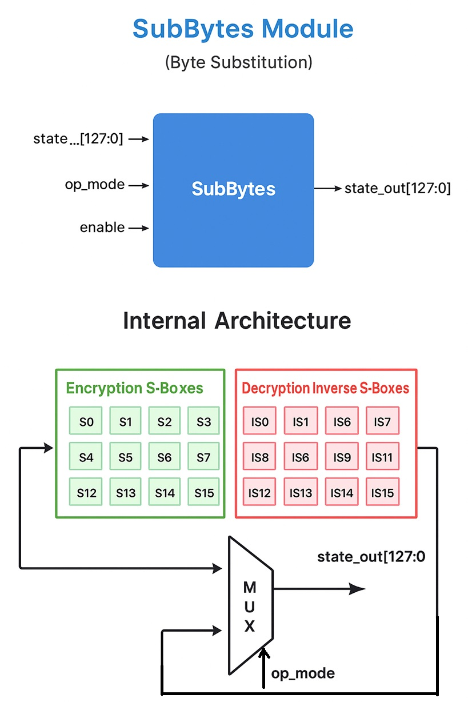
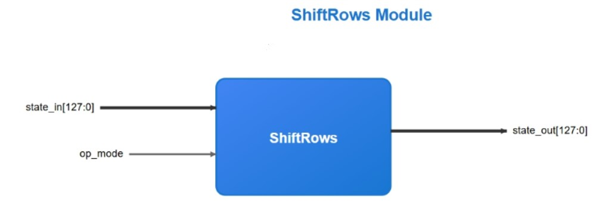
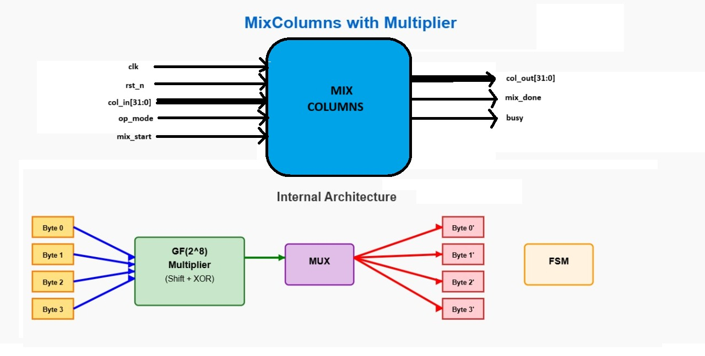
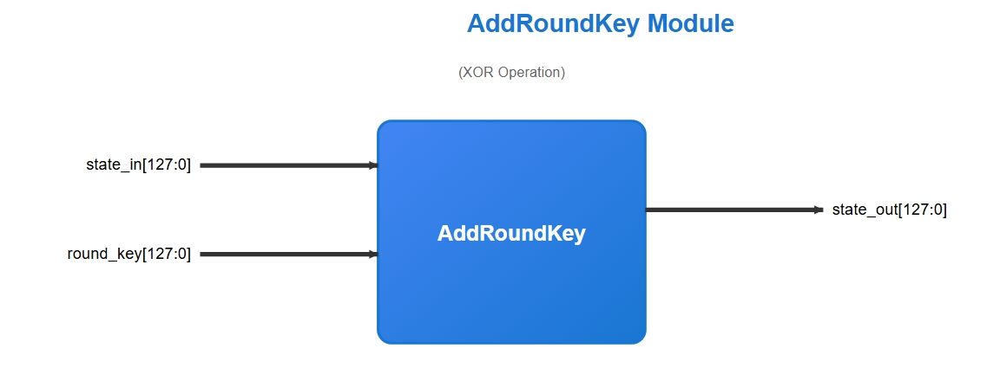
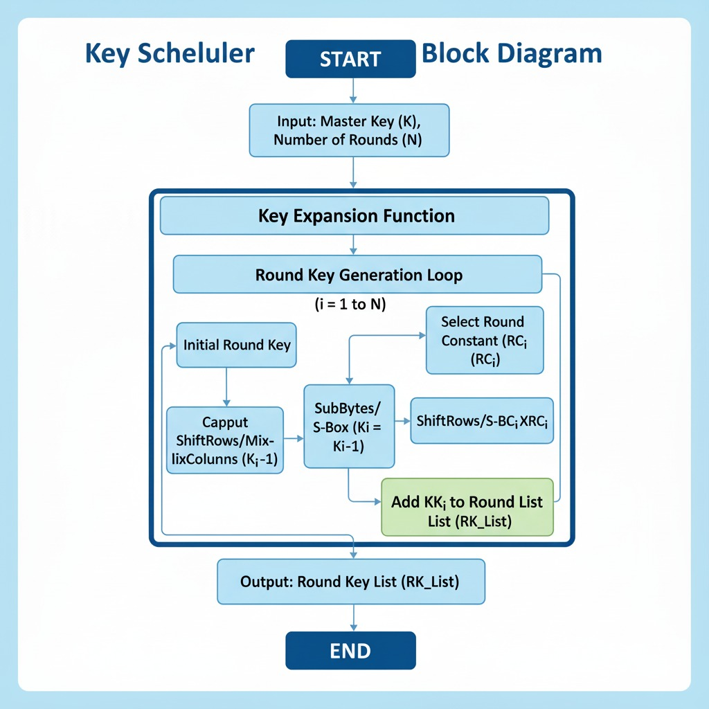
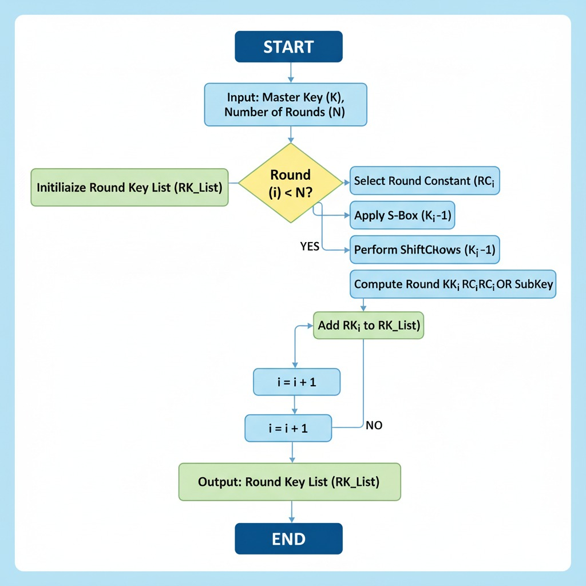
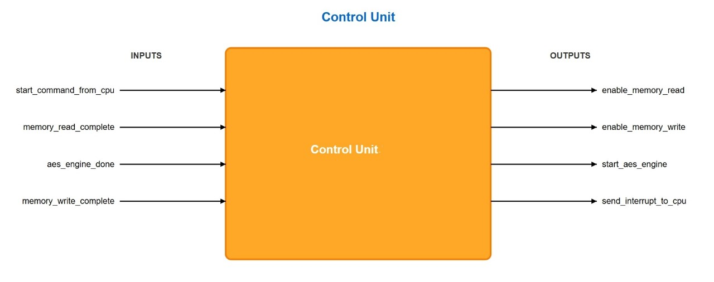

# Microwatt Design Challenge Proposal: `AES Accelerator for MicroWatt Core`

## Index
- [Section 1: Introduction](https://github.com/shinigami-777/Microwatt-Design-Challenge-Proposal/edit/main/README.md#introduction)
   - [1.1) Algorithm summary](https://github.com/shinigami-777/Microwatt-Design-Challenge-Proposal/edit/main/README.md#11-algorithm-summary)
   - [1.2) System level block diagram](https://github.com/shinigami-777/Microwatt-Design-Challenge-Proposal/edit/main/README.md#11-algorithm-summary)
   - [1.3) Key Design Philosophy](https://github.com/shinigami-777/Microwatt-Design-Challenge-Proposal/edit/main/README.md#13-key-design-philosophy)
- [Section 2: Overview of all Hardware Blocks](https://github.com/shinigami-777/Microwatt-Design-Challenge-Proposal/edit/main/README.md#overview-of-all-hardware-blocks)
   - [2.1) AES Cipher Block/Encryption Core](https://github.com/shinigami-777/Microwatt-Design-Challenge-Proposal/edit/main/README.md#21-aes-cipher-blockencryption-core)
   - [2.2) Introduction to AES Key Schedule Implementation](https://github.com/shinigami-777/Microwatt-Design-Challenge-Proposal/edit/main/README.md#22-introduction-to-aes-key-schedule-implementation)
   - [2.3) Control Unit](https://github.com/shinigami-777/Microwatt-Design-Challenge-Proposal/edit/main/README.md#23-control-unit)
   - [2.4) Interface Unit](https://github.com/shinigami-777/Microwatt-Design-Challenge-Proposal/edit/main/README.md#24-interface-unit)

## Introduction

### 1.1 Algorithm summary
AES is a type of block cipher that works with key sizes of 128/192/256 bits and encrypts data in blocks of 128 bits each. It takes 128 bits as input and outputs 128 bits of encrypted cipher text.
Since the block size is 128 bits, the cipher processes 128 bits (or 16 bytes) of the input data at a time.The number of rounds depends on the key length . 



A key Schedule algorithm is used to create keys for different rounds from the initial key. \
AES considers each block as a 16-byte (4 X 4) grid in a column-major arrangement.
Then the encryption begins and for each round it goes through 4 steps.


- **Sub Bytes:** This step involves substitution of each byte with another performed using a lookup table called the S-box. This substitution is done in a way that a byte is never substituted by itself and also not substituted by another byte which is a complement of the current byte.
 
- **Shift Rows:** A circular left shift is performed in this step.
 
```
                     	[ b0 | b1 | b2 | b3 ]                      [ b0 | b1 | b2 | b3 ]
                     	| b4 | b5 | b6 | b7 |         --->    	   | b5 | b6 | b7 | b4 |
                     	| b8 | b9 | b10 | b11 |              	   | b10 | b11 | b8 | b9 |
                     	[ b12 | b13 | b14 | b15]           	       [ b15 | b12 | b13 | b14 ]
```
 
- **Mix Columns:** This step is a matrix multiplication. Each column is multiplied with a specific matrix and thus the position of each byte in the column is changed as a result. This step is skipped in last round.
- **Add Round Key:** The resultant output of the previous stage is XOR-ed with the corresponding round key.

After n rounds, we get our ciphertext. The **decryption** process is simply the reverse of the encryption steps:


</br>

### 1.2 System level block diagram


 

### 1.3 Key Design Philosophy
This AES accelerator is designed for resource-constrained environments where minimizing hardware area and power consumption is more critical than achieving maximum throughput. The core design principles are simplicity, efficiency, and low footprint supporting AES-128, AES-192, and AES-256 encryption/decryption modes.
- **Simple Iterative Architecture:** Single hardware block for round transformation used repeatedly across all rounds, drastically reducing required logic (LUTs and flip-flops).
- **Serial MixColumns Unit:** Most significant area-saving measure using a single, shared multiplication unit controlled by FSM, avoiding large parallel logic for matrix multiplication.
- **Optimized ROM for S-Box:** Read-Only Memory implementation provides predictable and efficient balance between speed and area.
- **Configurable Key Support:** Runtime selection between 128/192/256-bit keys with corresponding 10/12/14 rounds.
- **Bidirectional Operation:** Support for both encryption and decryption modes.

**Target Applications:** Embedded systems, IoT security modules, and low-power microcontrollers requiring compact and efficient AES coprocessor with full standard compliance.


## Overview of all Hardware Blocks

### 2.1 AES Cipher Block/Encryption Core

#### 2.1.1 Higher Level Block Diagram



**Input/Output Signals:**

| Signal Name      | Direction | Width | Description                              |
|------------------|-----------|-------|------------------------------------------|
| clk              | Input     | 1     | System clock                             |
| rst_n            | Input     | 1     | Active-low reset                         |
| data_in          | Input     | 128   | Plain/cipher text input                  |
| key_in           | Input     | 256   | AES key input (padded for smaller keys)  |
| key_size_select  | Input     | 2     | Key size (00:128, 01:192, 10:256)        |
| op_mode_select   | Input     | 1     | Operation mode (0:Encrypt, 1:Decrypt)    |
| start_operation  | Input     | 1     | Start encryption/decryption              |
| data_out         | Output    | 128   | Cipher/plain text output                 |
| operation_done   | Output    | 1     | Operation complete                       |
| round_cnt        | Internal  | 4     | Current round counter (0-14)             |
| max_rounds       | Internal  | 4     | Maximum rounds based on key size         |


#### 2.1.2 SubBytes using S-box (Parallel 16-Unit Implementation)
- **Justification:** 16 parallel S-box units for encryption and 16 parallel inverse S-box units for decryption provide optimal throughput by processing the entire 128-bit state in a single clock cycle. This eliminates the serialization bottleneck and significantly improves performance. Each S-box is implemented as a 256x8-bit ROM, totaling 32 ROM blocks (16 forward + 16 inverse). The area cost is justified by the substantial cycle count reduction.

- **Performance Impact:**
   - **Single-cycle SubBytes operation** (vs. 16-cycle serial approach)
   - **Eliminates byte selection logic** and associated control complexity
   - **Reduces overall encryption latency by ~15 cycles per block**
   - **Simplifies control FSM** with no SubBytes serialization states

- **Block Diagram:**




- **Input/Output Signals:**

| Signal Name | Direction | Width | Description                   |
|-------------|-----------|-------|-------------------------------|
| state_in    | Input     | 128   | Full 128-bit state input      |
| op_mode     | Input     | 1     | 0:SubBytes, 1:InvSubBytes     |
| enable      | Input     | 1     | Enable S-box operation        |
| state_out   | Output    | 128   | Substituted 128-bit state output |


#### 2.1.3 ShiftRows

- **Justification:** Wire permutation with multiplexer for forward/inverse row shifting. Combinatorial logic with zero latency.
- **Block Diagram:**




- **Input/Output Signals:**

| Signal Name | Direction | Width | Description                  |
|-------------|-----------|-------|------------------------------|
| state_in    | Input     | 128   | Input state matrix           |
| op_mode     | Input     | 1     | 0:ShiftRows, 1:InvShiftRows  |
| state_out   | Output    | 128   | Shifted state matrix         |


#### 2.1.4 MixColumns (Serial Implementation)
- **Justification:** Single shared Galois Field multiplier handles both MixColumns and InvMixColumns operations. FSM controls coefficient selection and accumulation pattern based on operation mode. Significant area savings compared to parallel implementation.
- **Block Diagram:**




- **Input/Output Signals:**

| Signal Name | Direction | Width | Description                                                  |
|-------------|-----------|-------|--------------------------------------------------------------|
| clk         | Input     | 1     | System clock driving FSM, counters, and registers            |
| rst_n       | Input     | 1     | Active-low reset, initializes FSM and clears registers       |
| col_in      | Input     | 32    | Input column (4 bytes: s0..s3) to be transformed             |
| op_mode     | Input     | 1     | Operation mode: 0 = MixColumns, 1 = InvMixColumns            |
| mix_start   | Input     | 1     | Start signal; begins MixColumns operation                    |
| col_out     | Output    | 32    | Mixed output column (4 bytes after transformation)           |
| mix_done    | Output    | 1     | Indicates MixColumns/InvMixColumns operation is complete     |
| busy        | Output    | 1     | High while operation is in progress; low when idle           |

#### 2.1.5 AddRoundKey
- **Justification:** Simple XOR operation, combinatorial implementation with zero latency. Same logic works for all key sizes and both encryption/decryption.
- **Block Diagram:**




- **Input/Output Signals:**

| Signal Name | Direction | Width | Description              |
|-------------|-----------|-------|--------------------------|
| state_in    | Input     | 128   | Current state            |
| round_key   | Input     | 128   | Current round key        |
| state_out   | Output    | 128   | State after key addition |


### 2.2 Introduction to AES Key Schedule Implementation

#### 2.2.1 General Overview
The AES (Advanced Encryption Standard) algorithm requires the generation of multiple round keys from the initial secret key. This process is known as the key schedule or key expansion, and it is a crucial component for AES encryption or decryption modules.
 
We have used Dynamic Pipelined Approach in which the key schedule logic is broken down into multiple pipeline stages, with registers inserted between operations. This design allows higher clock frequencies by splitting the critical path and enables concurrent processing of multiple pipeline stages. The dynamic pipelined method utilizes logic-based computations of S-boxes and other transformations, providing much higher throughput and scalability suitable for high-performance AES co-processors.

#### 2.2.2 Block Diagram





#### 2.2.3 Implementation
**1. Input Key Interface Block**
- Handles loading and buffering of the initial AES key (128/192/256 bits).
- Manages key size signals and input handshake protocols.
- Passes key data to the pipeline controller.

**2. Pipeline Control and FSM Block**
- Controls pipeline stages sequencing and flow control.
- Manages state transitions for key expansion rounds and supports all AES key lengths.
- Coordinates with the Microwatt core for synchronization and back-pressure.

**3. S-box Computation Block**
- Implements combinational logic or pipelined logic for the AES S-box transformation.
- Supports high-frequency operation via internal pipelining.
- Optionally shared with encryption core for resource efficiency.

**4. Key Expansion Pipeline Stages**
- Divided into sub-blocks:
   - RotWord Unit: Performs cyclic byte rotation on input word.
   - SubWord Unit: Applies S-box substitution to each byte of the word.
   - RCON & XOR Unit: XORs round constants and combines with previous key words.
   - Key Word XOR Unit: Computes next round key word by XORing current pipeline outputs.
- Each stage separated by pipeline registers for high clock frequency.

**5. Intermediate Key Storage Block**
- Uses dual-port RAM or register arrays to hold expanded round keys.
- Supports concurrent read/write access enabling dynamic expansion and retrieval.
- Provides storage for key reuse in decryption or multiple encryption rounds.

**6. Output Key Scheduling Block**
- Outputs the fully expanded round key segments aligned to encryption round timing.
- Generates valid/ready signals to interface with the AES datapath.
- Supports on-the-fly key generation or preloading for pipeline throughput.

**7. Test and Debug Interface Block**
- Provides hooks for observing internal pipeline states and key values.
- Supports interface for test vectors and hardware debug tools.
- Facilitates fault injection and error reporting for verification.

### 2.3 Control Unit
- **Justification:** Master FSM with configurable round handling and comprehensive error detection. Manages variable round counts and operation sequencing for all AES variants.
-  **Block Diagram:**



-  **Input/Output Signals:**

| Signal Name       | Direction | Width | Description                 |
|-------------------|-----------|-------|-----------------------------|
| clk               | Input     | 1     | System clock                |
| reset             | Input     | 1     | System reset                |
| key_size_select   | Input     | 2     | Key size selection          |
| op_mode_select    | Input     | 1     | Operation mode              |
| start_operation   | Input     | 1     | Start signal                |
| key_ready         | Input     | 1     | Key expansion complete       |
| mc_done           | Input     | 1     | MixColumns complete          |
| enable_datapath   | Output    | 1     | Enable datapath registers    |
| start_mc          | Output    | 1     | Start MixColumns             |
| select_rkey       | Output    | 4     | Round key selector           |
| operation_done    | Output    | 1     | Operation complete           |
| error             | Output    | 1     | Error detected               |


### 2.4 Interface Unit
- **Justification:** Standard Wishbone slave interface for seamless MicroWatt integration following proper bus protocol handshaking. Memory-mapped registers for configuration, control, status monitoring, and DMA-based data transfer. The interface supports both direct register access and DMA operations for efficient bulk data processing. Following are the components of Interface Unit.
   1. 	Bus Interface Logic
   2. 	Control and Status registers
   3. 	Data and Key Buffers
   4. 	DMA
 
- **Block Diagram:**


#### Wishbone Bus Protocol Implementation:
**Write Cycle Flow (CPU → AES)**\
   **1. Master drives signals:** The CPU places the target register address on wb_adr_i, asserts wb_cyc_i=1 and wb_stb_i=1, sets wb_we_i=1, and drives the 32-bit write data on wb_dat_i. (Microwatt will keep wb_stb_i and wb_cyc_i high until the cycle is finished).
   
   **2. Slave detects and decodes:** The AES accelerator sees wb_cyc_i and wb_stb_i asserted, checks that the address matches its block, and interprets the low-order bits of wb_adr_i as the register offset. For example, offset 0x00–0x0C might map to the 128-bit key registers, 0x10–0x1C to the plaintext input, 0x20 to a control register, etc. If the address hits the AES block, the slave knows this is a write to one of its registers.
   
   **3. Latching data:** On the next clock edge, the AES core latches the data from wb_dat_i into the selected register. For instance, if writing the AES key, this might be a piece of the 128-bit key; if writing plaintext, part of the input block; or it might set a control bit (like “start encryption”) in a control register.
   
   **4. lave asserts acknowledge:** After capturing the data, the AES slave asserts wb_ack_o=1 (often on the following cycle) to indicate the write is complete. At this point, the data on wb_dat_i has been safely stored. (wb_dat_o is not used during a write cycle.) Because Wishbone requires that wb_ack_o be generated only when the cycle is active, the AES peripheral only drives wb_ack_o high while wb_cyc_i && wb_stb_i remain asserted.
   
   **5. Completion:** When the CPU sees wb_ack_o=1, it knows the write has completed. The CPU and slave then drop wb_stb_i (and master will drop wb_cyc_i if the transfer is done). The slave then deasserts wb_ack_o. This completes the write transfer. (If more writes to other AES registers are needed, the CPU repeats the process with new addresses/data).


#### Read Cycle Flow (AES → CPU)
  **1. Master drives signals:** For a read, the CPU places the address on wb_adr_i, asserts wb_cyc_i=1, wb_stb_i=1, and sets wb_we_i=0. No data is driven by the CPU on wb_dat_i.

  **2. Slave detects and decodes:** The AES slave sees the valid cycle, checks the address, and recognizes a read from one of its registers. It retrieves the requested register’s value internally. For example, the CPU might be reading the status register or a word of the ciphertext output.

  **3. Slave drives data:** The AES core drives the 32-bit data onto wb_dat_o corresponding to the addressed register. By the time it asserts wb_ack_o=1, this data is stable. (In many implementations the slave waits one clock cycle before asserting ACK to ensure data setup; this is a synchronous handshake.)

  **4. Slave asserts acknowledge:** The slave asserts wb_ack_o=1 (while wb_cyc_i && wb_stb_i are still high) to signal the read data is valid.

   **5. CPU captures data:** The CPU latches the data from wb_dat_o when it sees wb_ack_o=1. Then the CPU deasserts wb_stb_i (and eventually wb_cyc_i), and the slave drops wb_ack_o, ending the transfer. If more data is needed (e.g. reading all 128 bits of ciphertext requires four 32-bit reads), the CPU repeats the process with the next address.


#### Register Field Definitions:

**CONTROL Register**
- **Bit 0:** START - Write 1 to begin AES operation
- **Bit 1:** MODE - 0=Encrypt, 1=Decrypt
- **Bits 3:2:** KEY_SIZE - 00=AES-128, 01=AES-192, 10=AES-256
- **Bits 31:4:** Reserved


**STATUS Register**
- **Bit 0:** BUSY - 1=Accelerator currently working
- **Bit 1:** DONE - 1=Operation completed (generates interrupt if enabled)
- **Bit 2:** ERROR - 1=Last operation failed
- **Bit 3:** INT_ENABLE - 1=Enable interrupt on completion
- **Bits 31:4:** Reserved

#### Input/Output Signals:

| Signal Name  | Direction | Width | Description                          |
|--------------|-----------|-------|--------------------------------------|
| wb_clk_i     | Input     | 1     | Wishbone clock                       |
| wb_rst_i     | Input     | 1     | Wishbone reset                       |
| wb_adr_i     | Input     | 8     | Register address (byte addressing)   |
| wb_dat_i     | Input     | 32    | Write data bus                       |
| wb_dat_o     | Output    | 32    | Read data bus                        |
| wb_we_i      | Input     | 1     | Write enable (1=write, 0=read)       |
| wb_stb_i     | Input     | 1     | Strobe signal (valid transfer)       |
| wb_cyc_i     | Input     | 1     | Cycle signal (valid bus cycle)       |
| wb_ack_o     | Output    | 1     | Acknowledge (transfer complete)      |
| wb_err_o     | Output    | 1     | Bus error (invalid address/operation)|
| interrupt_o  | Output    | 1     | Completion interrupt to CPU          |


#### DMA Interface Extensions:
| Signal Name | Direction | Width | Description              |
|-------------|-----------|-------|--------------------------|
| dma_req_o   | Output    | 1     | DMA request signal       |
| dma_ack_i   | Input     | 1     | DMA acknowledge from system |
| dma_addr_o  | Output    | 64    | DMA memory address       |
| dma_data_i  | Input     | 32    | DMA read data            |
| dma_data_o  | Output    | 32    | DMA write data           |
| dma_we_o    | Output    | 1     | DMA write enable         |
| dma_be_o    | Output    | 4     | DMA byte enable          |

